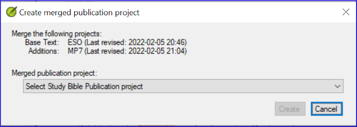

**Introdução**  
Com o Paratext 9.2 (e superior), você pode criar uma Bíblia de Estudo com base em sua tradução, adicionando parágrafos introdutórios, caixas de texto e notas de rodapé detalhadas e referências cruzadas adicionais para ajudar o usuário a ter uma compreensão mais profunda do texto bíblico.

**Em que parte do processo você está?**  
Antes de criar uma Bíblia de Estudo, é necessário traduzir e verificar consultas o Novo Testamento (ou partes dele). Em seguida, o administrador pode criar um novo projeto (veja abaixo).

**Por que isso é importante?**  
As informações da Bíblia de Estudo são criadas em um projeto separado com links para o texto traduzido. Se o texto traduzido for alterado, o link pode ser interrompido. Os links podem ser corrigidos, mas é menos provável que isso seja um problema se o texto estiver estável.

**O que você fará?**  
Você (ou seu administrador) criará um **Projeto de Adições da Bíblia de Estudo**. Como o nome sugere, é aqui que você pode adicionar os materiais de estudo (sem afetar sua tradução).

Este projeto separado contém uma cópia somente leitura do seu projeto e seu texto adicional. Quando estiver pronto, você poderá mesclar o projeto de Adições da Bíblia de Estudo com o projeto de tradução em um terceiro projeto.

- Criar um novo projeto de Adições da Bíblia de Estudo com base em sua tradução
- Registrar o novo projeto
- Adicionar o material adicional (introduções, caixas de texto, notas de rodapé e referências cruzadas)
- Ocultar qualquer texto não bíblico na tradução base (por exemplo, títulos)
- Mesclar os projetos para criar um projeto de publicação.

### Criar um projeto de Adições da Bíblia de Estudo
1. Use o menu do Paratexto para criar um novo projeto.
1. Defina o tipo de projeto como Adições da Bíblia de Estudo.
1. Escolha seu projeto de tradução como projeto "baseado em".
1. Você precisará registrar o novo projeto.
   - *Uma cópia somente leitura em cinza do seu projeto é exibida, com uma barra de ferramentas na parte superior.*  

## Adicionar o material adicional
### Material introdutório
1. Posicione o cursor onde você gostaria de adicionar o material adicional.
1. Clique em **Adicionar +** na barra de ferramentas.
1. Uma caixa azul com um \\ip é adicionada.
1. Digite o texto.

### Texto da caixa de texto
1. Posicione o cursor onde você gostaria de adicionar o material adicional.
1. Clique em **\\esb** na barra de ferramentas.
1. Uma caixa de texto é aberta com um marcador \\ms adicionado.
1. Digite o título após o marcador \\ms.
1. Pressione Enter.
1. Escolha um marcador para o texto seguinte.
1. Digite o texto.
1. Continue conforme necessário.

### Referência cruzada ampliada

1. Posicione o cursor onde você gostaria que a referência cruzada fosse chamada.
1. Clique em **\\ex** na barra de ferramentas.
1. Um painel de nota de rodapé é aberto com marcadores \\ex adicionados.
1. Digite a referência cruzada.

### Nota de rodapé ampliada
1. Posicione o cursor onde você gostaria de adicionar a nota de rodapé adicional.
1. Clique em **\\ef** na barra de ferramentas.
1. Um painel de nota de rodapé é aberto com os marcadores \\ef apropriados.
1. Adicione as notas de rodapé conforme necessário.

### Ocultar material não bíblico
Você pode ocultar material não bíblico, como títulos, da tradução.

1. Posicione o cursor onde você gostaria de adicionar a nota de rodapé adicional.
1. Clique em **Ocultar** na barra de ferramentas.
1. O texto é exibido em uma caixa cinza.

### Comparar versões

1. Abra um projeto de Adições da Bíblia de Estudo.
1. No menu **Projeto**,
1. Em **Projeto**, escolha **Comparar Versões**.
   *As alterações nas adições são exibidas*.

### Mesclar os projetos para criar um projeto de publicação
Para publicar a Bíblia de Estudo, você precisa criar um projeto de publicação.

1. Clique no menu Projeto.
1. Escolha "Criar projeto de publicação mesclado".
   
1. Clique na lista suspensa "Projeto de publicação mesclado".
1. Crie um novo projeto ou escolha um projeto anterior.
1. Clique em **Criar**.
   - *O Paratexto mescla o projeto de tradução e o projeto de Adições da Bíblia de Estudo e exibe o projeto de publicação mesclado*.
1. Se necessário, altere a visualização para Visualização Prévia.

### Fazendo alterações
Agora você tem três projetos.

1. Seu projeto de tradução original.
2. O projeto de Adições da Bíblia de Estudo.
3. O projeto de publicação mesclado.

- *Qualquer correção na tradução* deve ser feita no *projeto de tradução original*.
   - Essas correções serão atualizadas no projeto de Adições da Bíblia de Estudo quando você recriar o projeto de publicação mesclado.
   - *Qualquer correção no material de estudo da Bíblia* deve ser feita no *projeto de Adições da Bíblia de Estudo*.
- O *projeto de publicação mesclado* é somente leitura e não pode ser alterado.
   - Para atualizar as alterações, recrie o projeto de publicação mesclado novamente.

### Projeto de Adições da Bíblia de Estudo - Comparar versões
No Paratext 9.3, agora é possível comparar versões.
1. Abra um projeto de Adições da Bíblia de Estudo.
1. No menu **Projeto**,
1. Em **Projeto**, escolha **Comparar Versões**.
   - *As alterações nas adições são exibidas*.

### Imprimindo a Bíblia de Estudo com o PTXPrint
O PTXPrint versão 2.1.x (e superior) pode imprimir o projeto de publicação mesclado. Para instruções detalhadas, consulte https://software.sil.org/ptxprint/how-to-study-bible-layout/