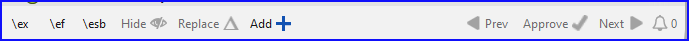

# Creating a Study Bible with Paratext 9.5 {#98137245ea6a44b79015596b67b3c634}

There are a number of Study Bible Additions (improvements in Paratext 9.5 listed below. These will be further documented in the next edition of the manual.

### Study Bible Additions (SBA) Improvements {#1b9598a5fd4080d687aee9efa3c83bfd}

- SBA now includes support for **Assignments and Progress** tracking!

- Adds support for displaying **figures in footnotes and sidebars**.

- **Scripture Reference Settings** within SBA projects can now override the settings of the base project.

- Improved **checking features**, ensuring more accurate and efficient review processes.

- It is now possible to add extended notes and sidebars for added or replaced content.

- Base project additional books (GLO, etc.) are incorporated in a SBA project.

- Handling of whitespace and invisible characters is supported in a SBA project.

- Adds an option for the default location of extended note callers.

- SBA-specific spelling discussion notes can be created in the Wordlist.

- Improvements to extracting a Legacy Study Bible into an SBA.

## Paratext 9.4 {#1b9598a5fd4080ac9c68e321981667bc}

The improvements in 9.5 has not yet been implemented here.

:::info

The **Study Bible Additions (SBA)** features implemented in **9.4 beta** requires that the SBA project be migrated, due to a data format change. The new 9.4 SBA data format is NOT compatible with the PT 9.3 version. In order to use the new SBA features, all project members should move to PT 9.4 beta and the project administrator should migrate the SBA project.

:::

**Introduction**  With Paratext 9.2 (and above) you can create a study Bible based on your translation by adding introductory paragraphs, sidebars and detailed footnotes and additional cross-references to help your user have a deeper understanding of the Bible text.

**Where are you in the process?**  Before you can create a Study Bible, you will want to translate and consultant check your New Testament (or portions). Em seguida, o administrador pode criar um novo projeto (veja abaixo).

**Why is this important?**  Study Bible information is created in a separate project with links to the translated text. Se o texto traduzido for alterado, o link pode ser interrompido. Os links podem ser corrigidos, mas é menos provável que isso seja um problema se o texto estiver estável.

**What will you do?**  You (or your administrator) will create a **Study Bible Additions project**. Com o Paratext 9.2 (e superior), você pode criar uma Bíblia de Estudo com base em sua tradução, adicionando parágrafos introdutórios, caixas de texto e notas de rodapé detalhadas e referências cruzadas adicionais para ajudar o usuário a ter uma compreensão mais profunda do texto bíblico.

Este projeto separado contém uma cópia somente leitura do seu projeto e seu texto adicional. Quando estiver pronto, você poderá mesclar o projeto de Adições da Bíblia de Estudo com o projeto de tradução em um terceiro projeto.

- Bíblia de Estudo

or

- Criar um novo projeto de Adições da Bíblia de Estudo com base em sua tradução
- Registrar o novo projeto
- Adicionar o material adicional (introduções, caixas de texto, notas de rodapé e referências cruzadas)
- Ocultar qualquer texto não bíblico na tradução base (por exemplo, títulos)
- Mesclar os projetos para criar um projeto de publicação.

:::info Upgrade

Paratext 9.4 allows you to re-order cross-references, footnotes, and sidebars. For more details, watch [this video on Study Bible additions in 9,4](https://vimeo.com/858761672)

:::

## Migrate an earlier version of the Study Bible Additions {#0a743ded6dc24fc399975383664db289}

- Abra um projeto de Adições da Bíblia de Estudo.
    - A notice is displayed explaining how to migrate your project.

        

## To Create a new Study Bible Additions project {#7ed7e93951db49deaf2c5cf7d4d15d70}

1. Use the **Paratext menu** to create a **new project**.
2. Set the **type** of project to **Study Bible Additions**.
3. Choose your translation project for the **“based on” project**.
4. You will need to **register** the new project.
    - _A grey-out read-only copy of your project is displayed, with a toolbar at the top._

## Add the additional material {#e7a1b3e1b97b4eed9be5b9f1c2ed0dcd}

### Introductory material {#05a4f1d78d3549d9ac44235760b89873}

1. Posicione o cursor onde você gostaria de adicionar o material adicional.
2. Click **Add +** on the toolbar
3. Uma caixa azul com um \\ip é adicionada.
4. Digite o texto.

### Sidebar text {#ab2be09dfc0e4fdeb177091e89785b58}

1. Posicione o cursor onde você gostaria de adicionar o material adicional.
2. click **\esb** on the toolbar
    - _A sidebar panel is opened with a \ms marker added_
3. Digite o título após o marcador \\ms.
4. Pressione Enter.
5. Escolha um marcador para o texto seguinte.
6. Digite o texto.
7. Continue as needed.

### Extended cross-reference {#cbcab8e8c6a64e38bf737472fe26d8e9}

1. Posicione o cursor onde você gostaria que a referência cruzada fosse chamada.
2. click **\ex** on the toolbar
    1. Um painel de nota de rodapé é aberto com marcadores \\ex adicionados.
3. Digite a referência cruzada.

### Extended footnote {#864c186270064955922ed758dc7d9fcf}

1. Posicione o cursor onde você gostaria de adicionar a nota de rodapé adicional.
2. click **\ef** on the toolbar
3. Um painel de nota de rodapé é aberto com os marcadores \\ef apropriados.
4. Adicione as notas de rodapé conforme necessário.

### Hide non-scriptural material {#8fff7769e5ae4060b0f1ffef9a979a79}

Você pode ocultar material não bíblico, como títulos, da tradução.

1. Posicione o cursor onde você gostaria de adicionar a nota de rodapé adicional.
2. Click **Hide** on the toolbar
    - _The text is displayed in a greyed-out box._

## Merge the projects to create a publication project {#23a03d9d683240a6a21290721a8dbb93}

Para publicar a Bíblia de Estudo, você precisa criar um projeto de publicação.

1. Clique no menu Projeto.

2. Escolha "Criar projeto de publicação mesclado".

    

3. Click the dropdown list “**Merged publication project**”.

4. Crie um novo projeto ou escolha um projeto anterior.

5. Click **Create**
    - _Paratext merges the translation project and the Study Bible Additions project and displays the Merged publication project._

6. If necessary change the view to **Preview**.

### Making changes {#9bd2afcdbf5946038a9b70561fcebc5d}

Agora você tem três projetos.

1. Seu projeto de tradução original.
2. O projeto de Adições da Bíblia de Estudo.
3. O projeto de publicação mesclado.

- _Any corrections to the translation_ should be made to the _original translation project_.
    - Essas correções serão atualizadas no projeto de Adições da Bíblia de Estudo quando você recriar o projeto de publicação mesclado.
    - _Any corrections to the Study Bible material_ should be made in the _Study Bible Additions project_.
- The _merged publication project_ is read-only and cannot be changed.
    - Para atualizar as alterações, recrie o projeto de publicação mesclado novamente.

## Study Bible Additions project - Compare versions {#7b7d078eecd44a71ae7fa6217ba07218}

No Paratext 9.3, agora é possível comparar versões.

1. Abra um projeto de Adições da Bíblia de Estudo.
2. From the **Project** menu,
3. Under **Project**, choose **Compare Versions**
    - _The changes in the additions are displayed_.

## Printing the Study Bible with PTXPrint {#cfc9e16b905c4aa48c7aad34c7c5ef9a}

O PTXPrint versão 2.1.x (e superior) pode imprimir o projeto de publicação mesclado. For detailed instructions, see [https://software.sil.org/ptxprint/how-to-study-bible-layout/](https://software.sil.org/ptxprint/how-to-study-bible-layout/)

